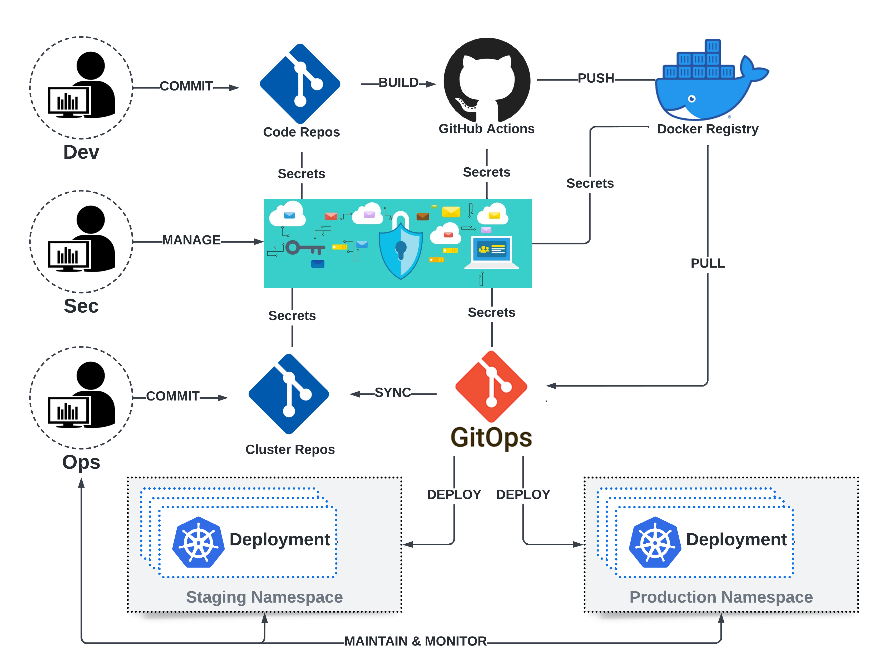
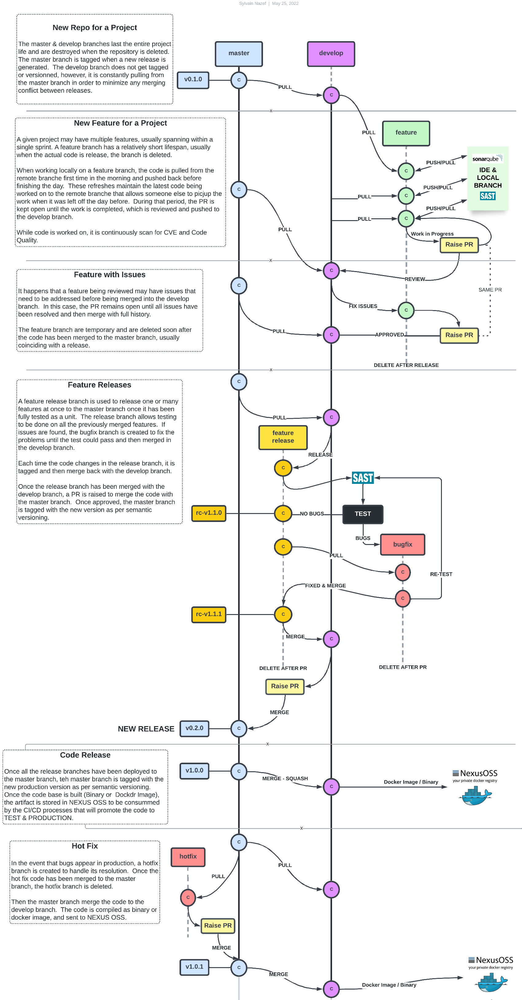

# github-actions-template
Templates for GitHub Actions
#
## Events that trigger workflows
Workflow triggers are events that cause a workflow to run.  These events can be:

+ Events that occur in your workflow's repository using event activity types & filters
+ Events that occur outside of GitHub and trigger a repository_dispatch event on GitHub
+ Scheduled times
+ Manual

## Required Software
In order to get finer grain control of GitHub Pull Request from the command line, we need to get GitHub CLI, or gh, which is a command-line interface to GitHub for use in terminal or scripts.
It could be installed on Windows, Linux, and Mac as per:

Refs:
    + https://cli.github.com/manual/
#
## CI/CD Workflow
A pipeline as code file specifies the stages, jobs, and actions for a pipeline to perform. Because the file is versioned, changes in pipeline code can be tested in branches with the corresponding application release.

+ The pipeline as code model of creating continuous integration pipelines and continuous deployment is an industry best practice addressing the following pain points: 
+ Auditing was limited to what was already built-in
+ Developers and Operations Team were unable to collaborate
+ Troubleshooting problems across applications and infrastructure was difficult
+ Difficult to rollback changes to the last known configuration
+ Pipelines prone to breaking

A high level diagram illustrating the different activities across a CI/CD Pipeline is depicted herein:



This diagram delineates the different actions executed by the PBS DevSecOps teams, they are:

+ Development Team (Dev) responsible for:
    + Code creation and management for all applications
    + Unit & Integration Testing
    + Generation of artifacts (binaries and docker images)

+ Security Team (Sec) responsible for:
    + Establishing security policies and supporting tools
    + Constantly monitoring for vulnerabilities from development to production
    + Responsible for addressing security breaches
    + Manage the Software Bill of Material (SBoM) and CVE advisories

+ Operations Team (Ops)  responsible for:
    + Create virtual servers and networking across all environments
    + Deploy, manage, and monitor kubernetes clusters

These activities are managed under the teams' respective workflows that are also dovetailing on each other to provide maximum coverage throughout the enterprise.  For this project, only the Development (GitHub Actions) part of the CI/CD pipeline is presented.
#
### GitHub Actions - Continuous Integration
Develop templates to implement the different triggering mechanism for specific conditions supporting the Master Git Workflow as presented below:



This pipeline essentially covers all aspect of code creation, testing, compilation, and version management.  So our development pipeline must be able to automate as much as possible of the following GitHub Workflow:
#

## GitHub Action Workflow Templates


### Feature Branch Workflows

1. Feature Branch Push - No Actions   

Make sure there are no labels already assigned, then execute the following code against the feature branch:
```
### raise initial PR for code development
> gh pr create -B develop -d -a @me -t "feature set" -b "Initilization" -l sast-only
> gh pr list -B develop -s open
> gh pr edit 13 --add-label "sca-only,test-only"
> gh pr edit 13 --remove-label "test-only"
> git add .
> git commit -m "My commit message"
> git push 
```

2. Feature Branch Push - Code Scans (CVEs & SCA)     

```
> git add .
> git commit -m "Fixed code -  [sca-only,scan-only]"
> git push 
```

3. Feature Branch Push - Unit Test    

```
> git add .
> git commit -m "Fixed code -  [test-only]"
> git push 
```

4. Feature Branch Push - Ready for Pull Request (PR) to Develop Branch

```
> git add .
> git commit -m "Fixed code -  [all-jobs]"
> git push  
```

5. Merge Feature to Develop Branch - Approve Pull Request (PR) to Develop Branch

```
If you are alone working on FeatureB branch, the a pull --rebase develop is the best practice: you are replaying FeatureB changes on top of FeatureA. (and git push --force after).
```

### Develop Branch Workflows

1. Develop Branch Push - No Actions   

    In GitHub repo, switch to the develop branch and push to develop branch:

```
> git checkout develop
> git add .
> git commit -m "My message.  [skip-actions]"
> git push 
```

2. Develop Branch Push - Full Scans & Tests  
    
```
> git add .
> git commit -m "Fixed code -  [sca-only,scan-only,test-only]"
> git push 
```

3. BugFix Branch - Full Scans & Tests 

```
> git add .
> git commit -m "Fixed code -  [sca-only,scan-only,test-only]"
> git push 
```

4. Develop Branch Push - Ready for Pull Request (PR) to Master Branch

```
> git add .
> git commit -m "Fixed code -  [all-jobs]"
> git push  
```

5. Merge Develop to Master Branch - Approve Pull Request (PR) to Master Branch and Tag

```
```

### Master Branch Workflows

1.  Master Branch Push - No Actions 

```
> git checkout master
> git add .
> git commit -m "My message.  [skip-actions]"
> git push 
```

2.  Master Branch - Full Build

```
> git add .
> git commit -m "Fixed code -  [all-jobs]"
> git push  
```

3.  HotFix Branch - Full Build 

```
> git add .
> git commit -m "Fixed code -  [all-jobs]"
> git push  
```

4.  Master Branch - Build & Store Image / Binary 

```
> git add .
> git commit -m "Fixed code -  [create-image]"
> git push  
```