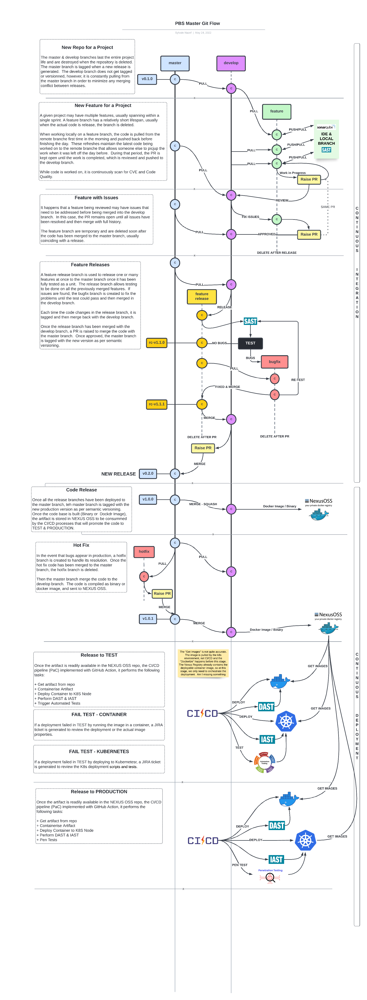

# github-actions-template
Templates for GitHub Actions
#
## Events that trigger workflows
Workflow triggers are events that cause a workflow to run.  These events can be:

+ Events that occur in your workflow's repository using event activity types & filters
+ Events that occur outside of GitHub and trigger a repository_dispatch event on GitHub
+ Scheduled times
+ Manual

## CI/CD Workflow

Develop templates to implement the different triggering mechanism for specific conditions supporting the Master Git Workflow as presented below:



## GitHub Action Workflow Templates

### Feature Branch Workflows

1. Feature Branch Push - No Actions   
   

```
> git add .
> git commit -m "My message.  [skip-actions]"
> git push 
```

2. Feature Branch Push - Code Scans (CVEs & SCA)     

```
> git add .
> git commit -m "Fixed code -  [sca-only,scan-only]"
> git push 
```

3. Feature Branch Push - Unit Test    

```
> git add .
> git commit -m "Fixed code -  [test-only]"
> git push 
```

4. Feature Branch Push - Ready for Pull Request (PR) to Develop Branch

```
> git add .
> git commit -m "Fixed code -  [all-jobs]"
> git push  
```

5. Merge Feature to Develop Branch - Approve Pull Request (PR) to Develop Branch

```
If you are alone working on FeatureB branch, the a pull --rebase develop is the best practice: you are replaying FeatureB changes on top of FeatureA. (and git push --force after).
```

### Develop Branch Workflows

1. Develop Branch Push - No Actions   

    In GitHub repo, switch to the develop branch and push to develop branch:

```
> git checkout develop
> git add .
> git commit -m "My message.  [skip-actions]"
> git push 
```

2. Develop Branch Push - Full Scans & Tests  
    
```
> git add .
> git commit -m "Fixed code -  [sca-only,scan-only,test-only]"
> git push 
```

3. BugFix Branch - Full Scans & Tests 

```
> git add .
> git commit -m "Fixed code -  [sca-only,scan-only,test-only]"
> git push 
```

4. Develop Branch Push - Ready for Pull Request (PR) to Master Branch

```
> git add .
> git commit -m "Fixed code -  [all-jobs]"
> git push  
```

5. Merge Develop to Master Branch - Approve Pull Request (PR) to Master Branch

```
```

### Master Branch Workflows

1.  Master Branch Push - No Actions 

```
> git checkout master
> git add .
> git commit -m "My message.  [skip-actions]"
> git push 
```

2.  Master Branch - Full Build

```
> git add .
> git commit -m "Fixed code -  [all-jobs]"
> git push  
```

3.  HotFix Branch - Full Build 

```
> git add .
> git commit -m "Fixed code -  [all-jobs]"
> git push  
```

4.  Master Branch - Build & Store Image / Binary 

```
> git add .
> git commit -m "Fixed code -  [create-image]"
> git push  
```